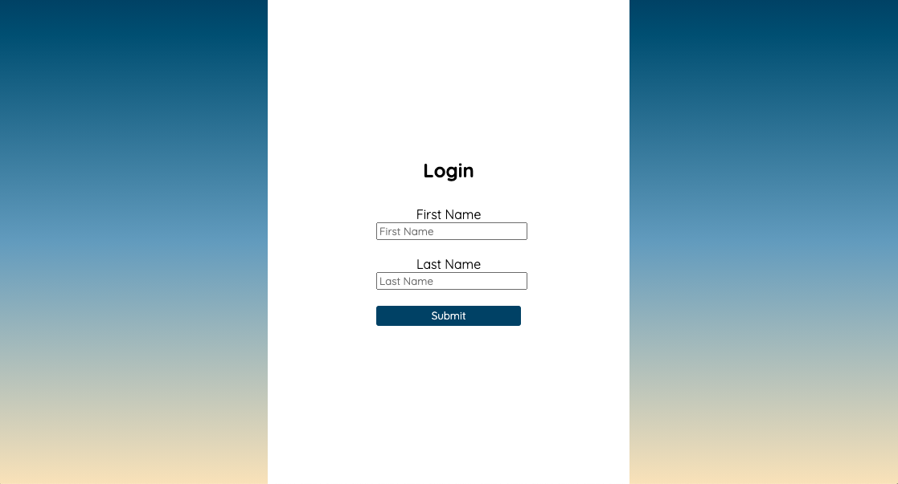
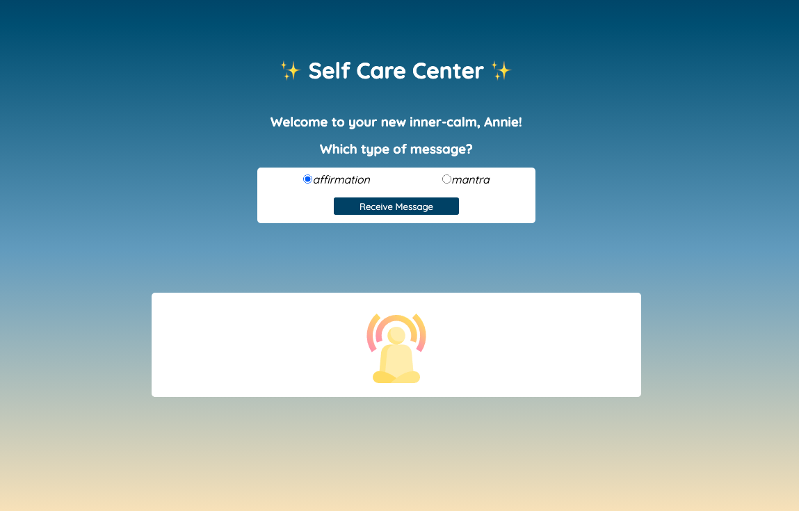

# Self Care Center
## Overview
How can I care for myself? One way is with affirmations and mantras!
Affirmations are thoughts of positive self-empowerment, meant to assert your self-worth.
Mantras are repetitive phrases that are repeated again and again during mindfulness practices. This app helps users remind themselves of their inherent value!





## Learning Goals

- Gain experience building an application that utilizes HTML, CSS and JavaScript
- Write HTML and CSS to match a provided comp
- Understand how to listen to and respond to user events
- Individualize programming skill set

## GitHub Link
```
https://github.com/aemiers/self-care-center
```

## Instructions for Running Project
1. Clone this repository.
2. CD into the repository in your terminal.
3. Run open index.html to view it in your browser.

## Technologies Used

- HTML
- CSS
- JavaScript
- GitHub
- Atom
- Terminal


## Contributers
- Anneke Miers

## Future Additions
I would like to add a favorite button so that users can save their favorite motivational sayings for when they need them the most. Adding animations would also be a great way to captivate the users' attention.
